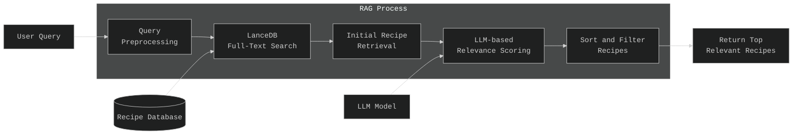

# Recipe Recommendation System

This project implements a recipe recommendation system that helps users find recipes based on their queries. The system utilizes RAG (Retrieval-Augmented Generation) technique where it first adjusts user queries, retrieves relevant recipes from LanceDB (multi-modal database) using FTS (Full-Text Search), then sorts relevant recipes based on relevance scores using an LLM as a judge, and finally returns only highly relevant recipes to the user. By combining advanced search capabilities with a user-friendly interface, this tool aims to simplify the process of discovering new recipes and meal ideas.


This diagram illustrates the flow of our recipe recommendation system, from user query to final recipe suggestions.

## Demo Video

Check out our demo video to see the Recipe Recommendation System in action:

[\[Watch the Demo Video\]](https://github.com/user-attachments/assets/363d3983-49a5-4de1-99cd-8f8258012309)

This video showcases the key features of our system, including:
- How to build a docker container using make file 
- The user interface and interaction

## Table of Contents

### Core Features
1. [Data Collection and Preprocessing](#1-data-collection-and-preprocessing)- Data is collected and preprocessed automatically using Python scripts
2. [Generating Synthetic Data](#2-generating-synthetic-data) - Synthetic data is generated for evaluation of retrieval methods
3. [Retrieval Method Comparison](#3-retrieval-method-comparison) - Comparison of retrieval methods (FAISS, LanceDB FTS, LanceDB Vector, LanceDB Hybrid)
4. [User Query Preprocessing](#4-user-query-preprocessing) - User query is preprocessed to improve recall, especially for negation recipes (e.g., 'soup without onions')
5. [LLM Based Relevance Scoring and Filtering](#5-llm-based-relevance-scoring-and-filtering) - LLM is used to score and filter retrieved recipes based on user query match
6. [Application Interface](#6-application-interface) - Gradio interface for user interaction, including login, query submission, recipe viewing, and feedback
7. [Data Collection for Monitoring](#7-data-collection) - All steps from user query to user clicks are logged into SQLite database
8. [Monitoring](#8-monitoring) - Python script creates a simple one-page summary of results
9. [Reproducibility](#9-reproducibility) - Docker file containerizes the application; Make file runs the application

### Additional Features
10. [Asyncio](#10-asyncio) - Handles concurrent API calls, especially when generating synthetic data
11. [LLM Factory](#11-llm-factory) - Creates LLM client with different APIs (inspired by [this YouTube video](https://www.youtube.com/watch?v=p6mkittu8Zc))
12. [Instructor Library](#12-instructor-library) - Structures output from LLM
13. [Evaluation Criteria](#evaluation-criteria) - Defines evaluation criteria for the project

### 1. Data Collection and Preprocessing

The data collection and preprocessing steps are handled automatically using two Python scripts:

1. Data Collection [`setup_data.py`](./src/data_preprocessing/setup_data.py):
   We use the Kaggle API to download the recipe dataset from a Kaggle competition [1]. The dataset contains food ingredients and recipes with image name mappings, providing a rich source of culinary information for our recipe recommendation system. The [`setup_data.py`](./src/data_preprocessing/setup_data.py) script performs the following tasks:

   - Authenticates with the Kaggle API using credentials from environment variables
   - Downloads the dataset to the `data` directory
   - Extracts the contents of the downloaded zip file
   - Moves the images to the correct directory (`data/Food_Images`)
   - Removes unnecessary files and directories

   To use this script, ensure you have set up your Kaggle API credentials in the `.env` file:
   ```
   KAGGLE_USERNAME=your_kaggle_username
   KAGGLE_KEY=your_kaggle_api_key
   ```

2. Data Preprocessing [`data_preprocessing.py`](./src/data_preprocessing/data_preprocessing.py):
   After the data is downloaded and extracted, we use [`data_preprocessing.py`](./src/data_preprocessing/data_preprocessing.py) to process the raw data. This script performs the following tasks:
   - Loads the downloaded CSV file
   - Combines the title, ingredients, and instructions into a single text for keyword search
   - Preprocesses the data for use in our recipe recommendation system
   - Saves the preprocessed data as `recipes.csv` for further use

Both of these scripts are automatically executed as part of the Docker build process, ensuring that the data is properly set up and preprocessed when the application is containerized.

To manually run these scripts (which is not necessary if you're using Docker), you can use the following commands:

```bash
python src/data_preprocessing/setup_data.py
python src/data_preprocessing/data_preprocessing.py
```

Note: Running these scripts manually requires that you have the necessary Python dependencies installed and the Kaggle API credentials properly set up in your environment.

[1]: https://www.kaggle.com/datasets/pes12017000148/food-ingredients-and-recipe-dataset-with-images

### 2. Generating Synthetic Data 

In the early stage of the application when we don't have user interaction data, to evaluate the initial retrieval performance of our system, we generate synthetic data in the form of user-like prompts for each recipe. This process is handled by the [ground_truth_generation.py](./src/data_preprocessing/ground_truth_generation.py) script.

1. Synthetic Data Generation:
   - We use **GPT-4-mini**, accessed through the OpenAI API, to generate 5 synthetic user prompts for each recipe.
   - Each prompt is designed to be a short, natural-sounding query (up to 10 words) that a user might use to search for the recipe.
   - This approach provides us with a diverse set of potential user inputs to test our retrieval system.

2. Implementation Details and Usage:
   - Supports processing test or full datasets:
     - Test mode (default): 10 samples, saves as `prompts_dataframe_test.csv`
     - Full dataset: 1000 samples, saves as `prompts_dataframe.csv`
   - Custom sample size possible with `--samples` argument

   Usage examples:
   ```bash
   python src/data_preprocessing/ground_truth_generation.py                    # Test mode (10 samples)
   python src/data_preprocessing/ground_truth_generation.py --samples 1000     # Full dataset (1000 samples)
   python src/data_preprocessing/ground_truth_generation.py --samples <number> # Custom number of samples
   ```

### 3. Retrieval Method Comparison

Once we have generated synthetic data, we can evaluate the performance of different retrieval methods on how well they can retrieve the original recipe based on user prompts. The evaluation metrics we use are Mean Reciprocal Rank (MRR) and Recall for top 1, 3, and 5 results. We use the [comparison_retrieval.py](./src/retrieval/comparison_retrieval.py) script to evaluate the performance of different retrieval methods such as FAISS, LanceDB Vector, LanceDB FTS, and LanceDB Hybrid.

1. FAISS (Facebook AI Similarity Search):
   FAISS is a library for efficient similarity search and clustering of dense vectors. It's optimized for speed and memory usage, making it suitable for large-scale vector search tasks.

2. LanceDB:
   LanceDB is a vector database that supports multiple search types:
   - Vector Search: Semantic search using vector embeddings
   - Full-Text Search (FTS): Traditional keyword-based text search
   - Hybrid Search: Combines vector and text search for potentially improved results

#### Evaluation Process

Our process is as follows:
1. Loads recipe data and synthetic prompts
2. Embeds the data using the sentence transformer model "multi-qa-MiniLM-L6-cos-v1"
3. Creates indexes for FAISS and LanceDB for semantic search (vector search)
4. Performs searches using different methods:
   - FAISS vector search
   - LanceDB vector search
   - LanceDB full-text search (FTS)
   - LanceDB hybrid search (vector + text)
5. Calculates performance metrics (MRR and Recall at k=1, k=3, and k=5) and retrieval times

#### Results

The detailed results of the comparison (sample size: 500) is below.
```
+---------------------------+---------+---------+---------+------------+------------+------------+------------------+
| Method                    | MRR@1   | MRR@3   | MRR@5   | Recall@1   | Recall@3   | Recall@5   | Retrieval Time   |
+===========================+=========+=========+=========+============+============+============+==================+
| FAISS                     | 0.78    | 0.84    | 0.84    | 0.78       | 0.90       | 0.93       | 3.35 s *         |
+---------------------------+---------+---------+---------+------------+------------+------------+------------------+
| LanceDB Vector            | 0.78    | 0.84    | 0.84    | 0.78       | 0.90       | 0.93       | 9.70 s           |
+---------------------------+---------+---------+---------+------------+------------+------------+------------------+
| LanceDB FTS (text search) | 0.86 *  | 0.90 *  | 0.91 *  | 0.86 *     | 0.95       | 0.97       | 7.76 s           |
+---------------------------+---------+---------+---------+------------+------------+------------+------------------+
| LanceDB Hybrid            | 0.84    | 0.89    | 0.90    | 0.84       | 0.96 *     | 0.98 *     | 73.91 s          |
+---------------------------+---------+---------+---------+------------+------------+------------+------------------+
* indicates the best performing method for each metric
```

#### Key Findings:
1. FAISS has the fastest retrieval time.
2. LanceDB FTS (text search) performs best in terms of MRR@1, MRR@3, MRR@5, and Recall@1.
3. LanceDB Hybrid search achieves the highest Recall@3 and Recall@5, but at the cost of significantly longer retrieval time.
4. LanceDB Vector search and FAISS show identical performance in terms of MRR and Recall, but FAISS is faster.

Based on these results, we have decided to proceed with the LanceDB Full-Text Search (FTS) method for our recipe retrieval system. It offers the best balance between accuracy (highest MRR and competitive Recall) and reasonable retrieval time. While the hybrid search shows slightly better Recall@3 and Recall@5, the significant increase in retrieval time doesn't justify its use for our current application needs.


### 4. User Query Preprocessing

During testing of the application, we found that the FTS does not perform well on negation queries (e.g., 'soup without onions') as well as when there are spelling mistakes in the user query (e.g., 'soup with oniins'). To address this, we implemented a user query preprocessing step that rewrites the user query to improve the recall of the system. This is done using the [query_preprocessor.py](./src/user_query_processing/query_preprocessor.py) script. Our approach is as follows:

1. Negation - We remove ingredients that are mentioned with negation (in the example with 'soup without onions' we rewrite it as 'soup'). The intuition is that we will retrieve around 10 different soups and there is a high chance that one of them will not include onions and when we feed this to LLM as a judge it will be able to select the correct recipe given that we also provide what the user didn't want. 

2. For spelling mistakes we use the same LLM call as we used for negation to correct the query and improve the recall.

3. We also ask LLM to provide feedback to a user in case if the query is not a recipe search query.

The output of this step is then used for retrieval as well as when we pass a user query to LLM as a judge.

### 5. LLM Based Relevance Scoring and Filtering

In this step, we use the LLM as a judge to score and filter retrieved recipes based on user query match. This is done using the [recipe_recommendation.py](./recipe_recommendation.py) script. In this call, we ask the LLM to score each recipe based on how well it matches the user query from 0 to 10, as well as to provide a reason for the score. We use this assessment to further filter out low-relevance recipes and log the reasons for low scores to help improve the model in the future.

### 6. Application Interface

The application interface is built using Gradio and allows users to interact with the system in several ways:

1. **Login Interface**:
   - Users provide the name

2. **Query Submission**:
   - Users can submit their queries to the system.
   - The system adjusts the query based on the preprocessing step.
   - The system displays the top 3 most relevant recipes with their image, title and options to check ingidients and instructions.

3. **Feedback Submission**:
   - Users can provide feedback if they like or dislike the recommended recipe. In case if the user dislikes the recipe they can also provide a text feedback with a reason why they disliked it.
   - As some of the images of recipes have a low quality, we ask users to give a feedback on the image quality. 
   - All the feedback is saved into SQLite database and logged for future reference. 

### 7. Data Collection

All the steps from user query to user clicks are logged into an SQLite database. This allows us to monitor the performance of the system and to log the user feedback for future reference. The script [db.py](./src/reporting/db.py) is used to initialize the database, create tables, and provide functions to log the data from the application.

### 8. Monitoring

For this stage of the application, we have created a simple one-page summary of the results using the [performance_report.py](./src/reporting/performance_report.py) script. This script creates a summary of the results and saves it as a PNG image. You can refer to an example of the report [here](./src/reporting/performance_report.png). Here we measure the likes/dislikes, the relevance score distribution, and the most common recipes that users liked or disliked.

### 9. Reproducibility

The application is containerized using Docker and orchestrated using Makefile. This allows us to run the application locally in a container or in the cloud. We use [Dockerfile](./Dockerfile) to build the image and [Makefile](./Makefile) to run the application.

To run the application locally, follow these steps:

1. Ensure you have Docker installed on your system.

2. Set up the environment variables:
   Create a `.env` file in the root directory with the following content:
   ```
   OPENAI_API_KEY=your_openai_api_key
   ANTHROPIC_API_KEY=your_anthropic_api_key
   GROQ_API_KEY=your_groq_api_key
   KAGGLE_USERNAME=your_kaggle_username
   KAGGLE_KEY=your_kaggle_api_key
   ```
   Replace `your_*_api_key` and Kaggle credentials with your actual keys.

3. Run the following commands:

   a. Build the Docker image:
      ```
      make build
      ```
      This builds the Docker image with all necessary dependencies and sets up the data.

   b. Run the Docker container:
      ```
      make run
      ```
      This starts the container and makes the application available at http://localhost:7861.

4. Open your web browser and go to `http://localhost:7861` to access the application.

Note: The application runs on port 7860 inside the container, which is mapped to port 7861 on your host machine.

Additional Makefile commands:
- To view Docker logs: `make logs`
- To clean up Docker resources: `make clean`
- To see all available commands: `make help`

If you encounter any issues:
- Ensure all required files are present in the project directory.
- Check that port 7861 is not being used by another application on your host machine.
- Make sure your `.env` file contains valid API keys.
- Review the Docker logs using `make logs` or:
  ```
  docker logs recipe-app
  ```

### 10. Asyncio
During the process of generating synthetic data, we use asyncio to handle concurrent API calls. This allows us to generate data much faster than if we were to do it sequentially. Below is an example of how we use asyncio to generate data:

```python
async def generate_data(num_samples):
    tasks = [generate_synthetic_data(i) for i in range(num_samples)]
    return await asyncio.gather(*tasks)   
```
As most APIs have a rate limit, we use a semaphore to prevent us from making too many requests at the same time. 

### 11. LLM Factory
Inspired by [this YouTube video](https://www.youtube.com/watch?v=p6mkittu8Zc), LLM Factory is used to create an LLM client with different APIs. This allows us to easily switch between different LLMs and different API keys. Below is an example of how we use LLM Factory to create an LLM client:

```python
client = LLMFactory("openai")
```

### 12. Instructor Library
One of the main challenges of working with LLMs is that it's hard to control the output. For example, we want to ensure that the output is in a particular format, or that it contains a particular piece of information.

Instructor is a library that helps with this by providing a way to structure the output from LLM. It allows us to provide a schema for the output and then use the LLM to generate the output in the correct format. The library is designed for simplicity, transparency, and control, built on top of Pydantic.

Some key features of Instructor include:
- Simple API with full prompt control
- Multi-language support
- Automatic reasking and validation
- Streaming support
- Powered by type hints

For more detailed information and usage examples, you can refer to the official Instructor documentation at [https://python.useinstructor.com/](https://python.useinstructor.com/).

### Evaluation Criteria

### Problem Description
- [ ] 0 points: The problem is not described
- [ ] 1 point: The problem is described but briefly or unclearly
- [X] 2 points: The problem is well-described and it's clear what problem the project solves

Explanation: Refer to the introduction at the beginning of this README.

### RAG Flow
- [ ] 0 points: No knowledge base or LLM is used
- [ ] 1 point: No knowledge base is used, and the LLM is queried directly
- [X] 2 points: Both a knowledge base and an LLM are used in the RAG flow

Explanation: Please refer to the RAG schema in the introduction at the beginning of this README.

### Retrieval Evaluation
- [ ] 0 points: No evaluation of retrieval is provided
- [ ] 1 point: Only one retrieval approach is evaluated
- [X] 2 points: Multiple retrieval approaches are evaluated, and the best one is used

Explanation: Please refer to the [Retrieval Method Comparison](#3-retrieval-method-comparison) section above. FAISS semantic search, LanceDB FTS, vector search and hybrid search were evaluated.

### RAG Evaluation
- [ ] 0 points: No evaluation of RAG is provided
- [ ] 1 point: Only one RAG approach (e.g., one prompt) is evaluated
- [X] 2 points: Multiple RAG approaches are evaluated, and the best one is used

Explanation: Please refer to the [User Query Preprocessing](#4-user-query-preprocessing) section above. User query preprocessing was evaluated to tackle recipe negation challenges (e.g., for 'soup without onions' text search might return 'soup with onions').

### Interface
- [ ] 0 points: No way to interact with the application at all
- [ ] 1 point: Command line interface, a script, or a Jupyter notebook
- [X] 2 points: UI (e.g., Streamlit), web application (e.g., Django), or an API (e.g., built with FastAPI)

Explanation: Gradio interface was built to interact with the application. See [Application Interface](#6-application-interface) section.

### Ingestion Pipeline
- [ ] 0 points: No ingestion
- [ ] 1 point: Semi-automated ingestion of the dataset into the knowledge base, e.g., with a Jupyter notebook
- [X] 2 points: Automated ingestion with a Python script or a special tool (e.g., Mage, dlt, Airflow, Prefect)

Explanation: Data preprocessing pipeline was built to ingest the dataset into LanceDB. This is orchestrated using Makefile. See [Data Collection and Preprocessing](#1-data-collection-and-preprocessing) section.

### Monitoring
- [ ] 0 points: No monitoring
- [ ] 1 point: User feedback is collected OR there's a monitoring dashboard
- [X] 2 points: User feedback is collected and there's a dashboard with at least 5 charts

Explanation: User feedback is collected in SQLite database and a Python script is used to create a simple one-pager summary of the results. See [Data Collection](#7-data-collection) and [Monitoring](#8-monitoring) sections.

### Containerization
- [ ] 0 points: No containerization
- [ ] 1 point: Dockerfile is provided for the main application OR there's a docker-compose for the dependencies only
- [X] 2 points: Everything is in docker-compose

Explanation: Dockerfile is provided for the main application and orchestrated using Makefile. See [Reproducibility](#9-reproducibility) section.

### Reproducibility
- [ ] 0 points: No instructions on how to run the code, the data is missing, or it's unclear how to access it
- [ ] 1 point: Some instructions are provided but are incomplete, OR instructions are clear and complete, the code works, but the data is missing
- [X] 2 points: Instructions are clear, the dataset is accessible, it's easy to run the code, and it works. The versions for all dependencies are specified.

Explanation: Comprehensive instructions are provided in the [Reproducibility](#9-reproducibility) section of this README file.

### Best Practices
- [X] Hybrid search: combining both text and vector search (at least evaluating it) (1 point)
- [X] Document re-ranking (1 point)
- [X] User query rewriting (1 point)

Explanation: Hybrid search was evaluated, however it was not significantly better. Refer to the [Retrieval Method Comparison](#3-retrieval-method-comparison) section above. Document re-ranking is used with LLM as a judge. User query rewriting is used to tackle recipe negation challenges.

### Bonus Points (not covered in the course)
- [ ] Deployment to the cloud (2 points)
- [X] Up to 3 extra bonus points for additional features (please specify):

Explanation: LLM Factory was used to create the LLM client with different APIs. Asyncio was used to handle concurrent API calls. See sections [LLM Factory](#11-llm-factory) and [Asyncio](#10-asyncio) for details.